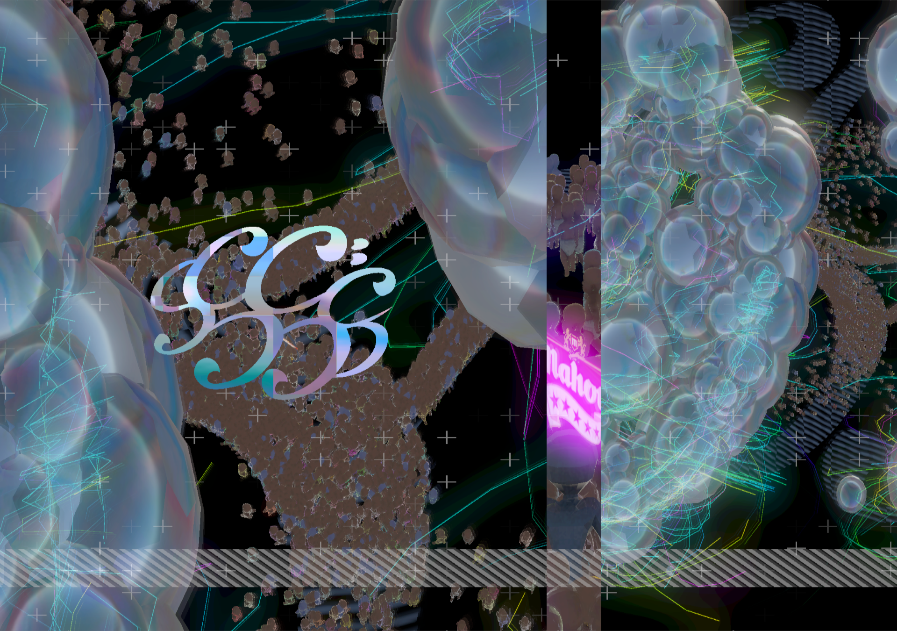
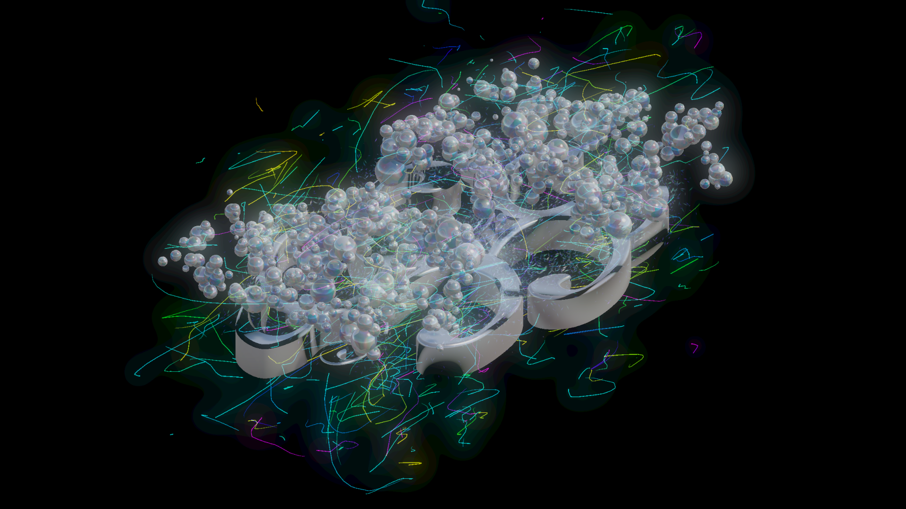
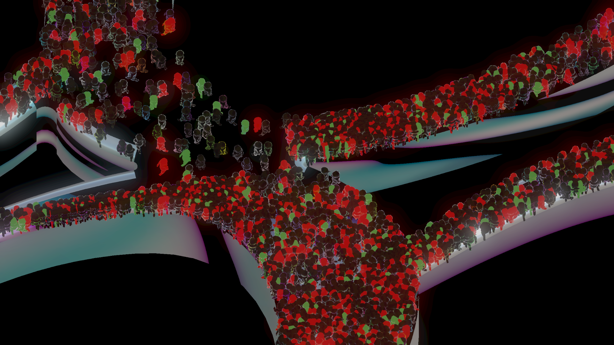
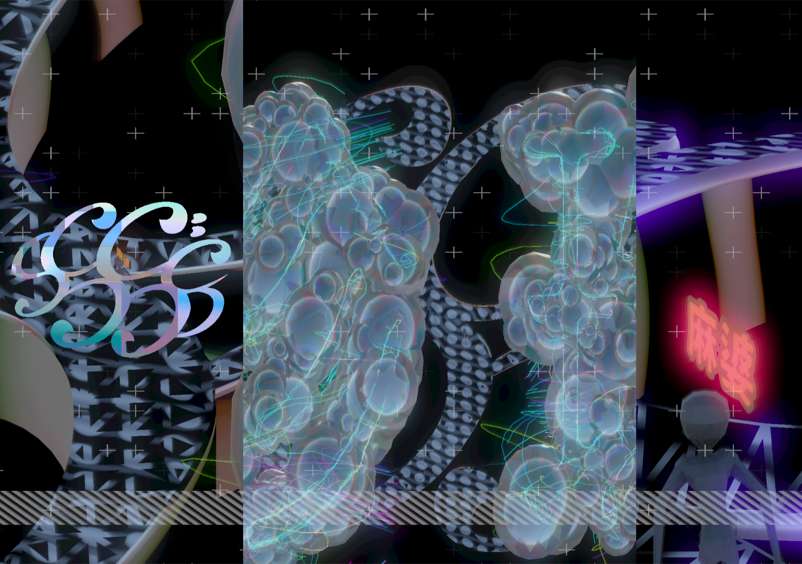

# 台湾料理店 珍珠のVJ制作

台湾料理店「珍珠（しんじゅ）」で開催されたイベントにて、音響連動型のVJを制作しました。\
DJの音声をFFTで解析し、低・中・高音ごとの特徴を抽出。\
各帯域の変化に応じてリアルタイムで反応するビジュアルを生成しています。\
For the event held at Shinju, a Taiwanese restaurant,\
I created an audio-reactive VJ visual system.\
By applying FFT analysis to the DJ’s audio,\
I captured real-time characteristics in the low, mid, and high-frequency.\
These values drove the generative visuals,
producing dynamic real-time reactions synchronized with the music.
## 📅 Date
Apr 2025
## 🎥 Demo Video
<iframe width="100%" height="400" src="https://www.youtube.com/embed/Xp4Q078MXng" frameborder="0" allowfullscreen></iframe>

## 🖼️ Images

## Programming Languages
C#/HLSL
