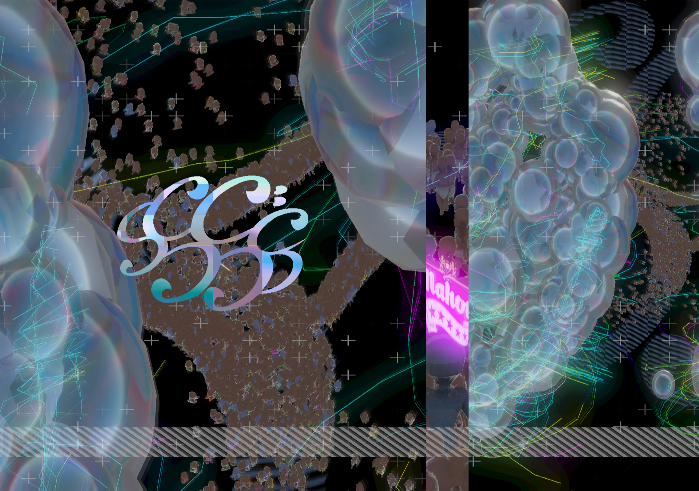
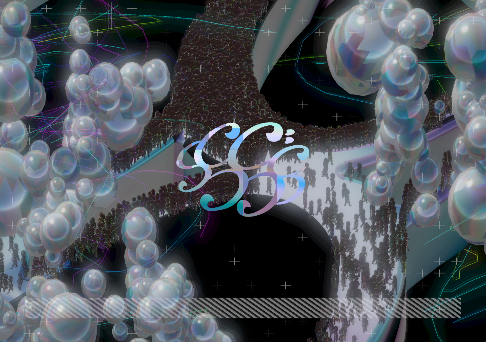
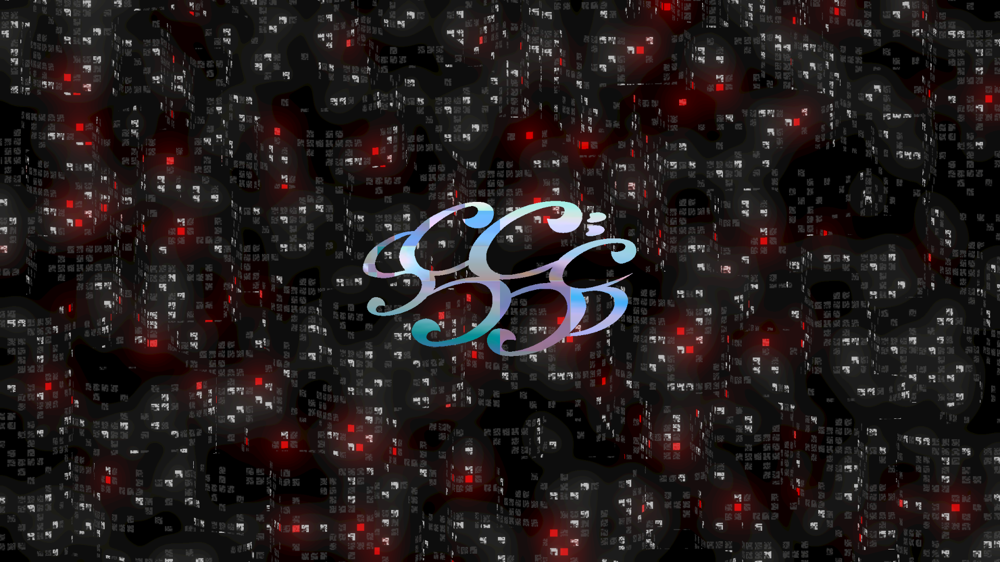
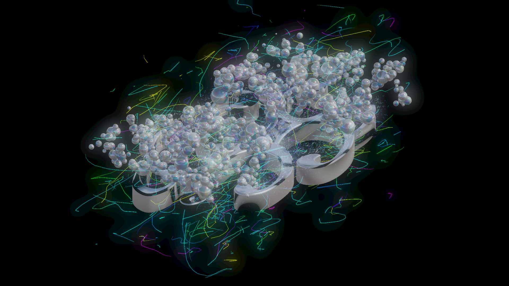
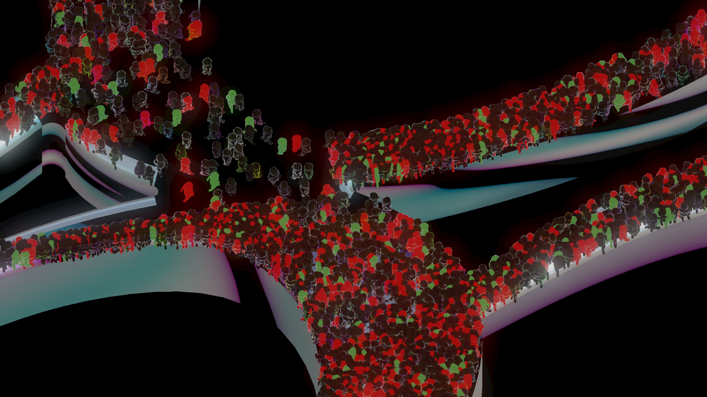
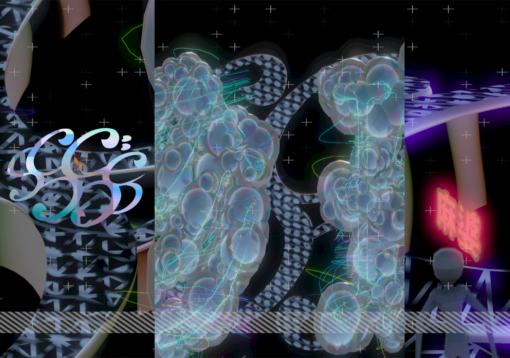
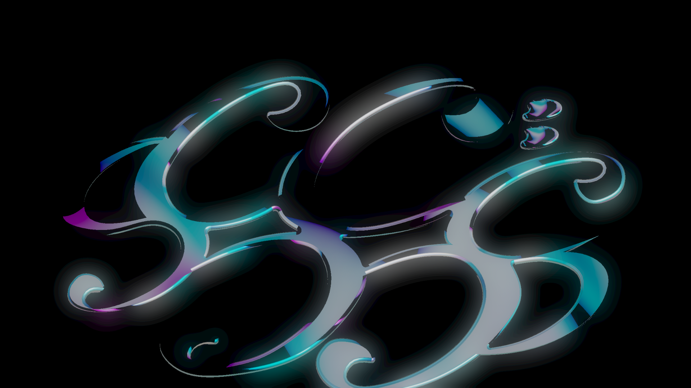

# Shinju / Pearl Audio-Reactive VJ Production

> **Roles:** Creative Technologist / Computer Graphics Engineer / Live Visuals Developer


## Executive Summary

### 日本語

台湾料理店「珍珠（しんじゅ） / Pearl」で開催された DJ イベント向けに、音響連動型の VJ ビジュアルを制作しました。DJ 音源を FFT で解析し、低域・中域・高域の変化を使って、色、動き、エフェクト量がリアルタイムに変化する映像を生成しました。

### English

I created an audio-reactive VJ system for a DJ event at Shinju / Pearl, a Taiwanese restaurant venue. The visuals used FFT analysis to read low-, mid-, and high-frequency movement from the DJ audio, then mapped those values into real-time motion, color, and effect changes.

## Demo Video

<iframe width="100%" height="420" src="https://www.youtube.com/embed/Xp4Q078MXng" title="Shinju / Pearl Audio-Reactive VJ Demo" frameborder="0" allowfullscreen></iframe>

## Documentation & Gallery Grid

<table width="100%">
  <tr>
    <td width="50%"></td>
    <td width="50%"></td>
  </tr>
  <tr>
    <td width="50%"></td>
    <td width="50%"></td>
  </tr>
  <tr>
    <td width="50%"></td>
    <td width="50%"></td>
  </tr>
  <tr>
    <td width="50%"></td>
    <td width="50%"></td>
  </tr>
  <tr>
    <td width="50%"></td>
    <td width="50%"></td>
  </tr>
  <tr>
    <td width="50%"></td>
    <td width="50%"></td>
  </tr>
</table>

## Technical Core & Architectural Highlights

### Audio Analysis

- Used FFT analysis to split the DJ audio into low-, mid-, and high-frequency bands.
- Mapped each band to simple visual controls such as scale, color, movement speed, and effect intensity.
- Added basic value smoothing so the visuals felt responsive without becoming too noisy.

### Visual System

- Built the control layer in C# and the visual response with HLSL shaders.
- Used real-time shader parameters instead of pre-rendered video playback.
- Tuned the look for a compact restaurant venue, with dense visuals that could read clearly in a live event setting.

### Live Production

- Kept the system lightweight enough for stable live playback.
- Adjusted intensity and motion during production to match the DJ set atmosphere.
- Documented the output through both video and still captures.

## Technical Pipeline Diagram

```text
[DJ Audio Input]
       |
       v
[FFT Analysis]
       |
       +--> [Low Band]  -> Bass-driven scale / impact
       +--> [Mid Band]  -> Motion / rhythm response
       +--> [High Band] -> Texture / effect detail
       |
       v
[C# Parameter Mapping]
       |
       v
[HLSL Visual Shader]
       |
       v
[Live Projection / Venue Output]
```

## Technical Stack

| Layer | Implementation |
|---|---|
| Audio analysis | FFT-based frequency band extraction |
| Runtime control | C# |
| Visual synthesis | HLSL shaders |
| Output | Live VJ visuals for venue projection |
