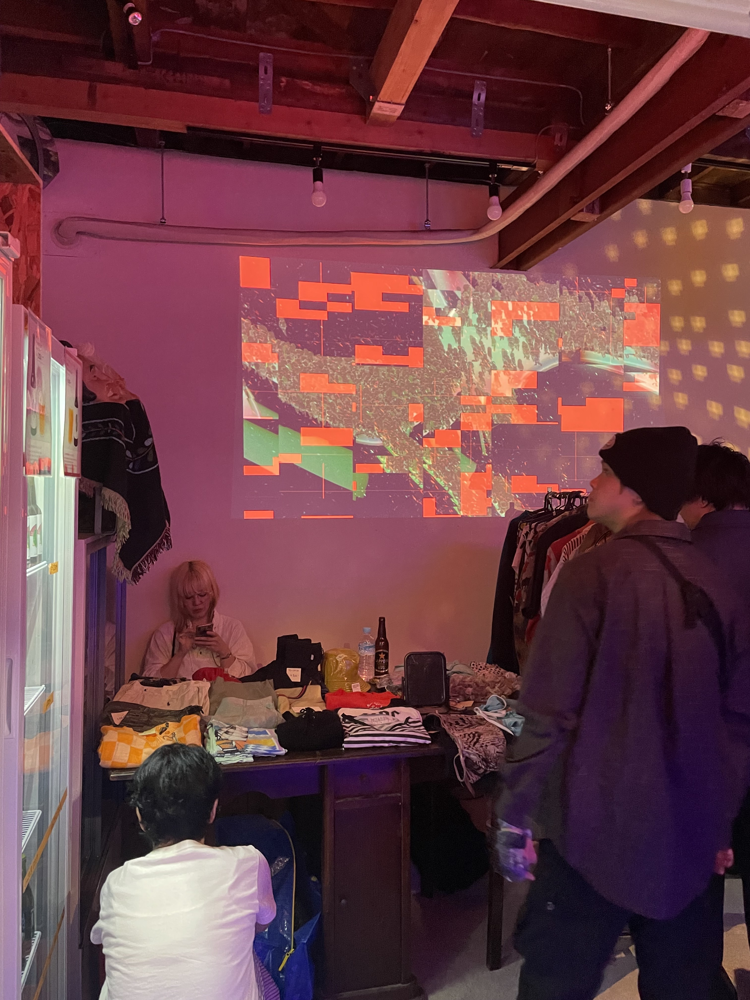
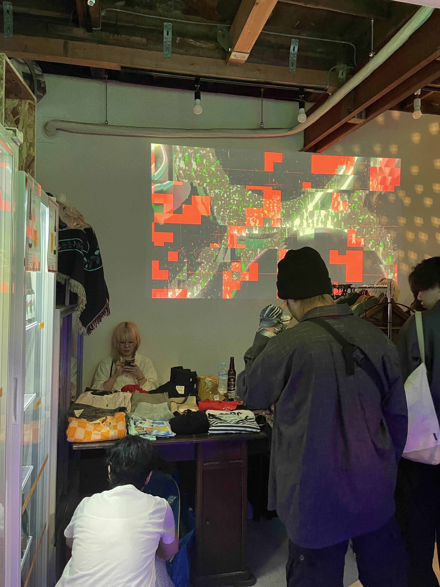
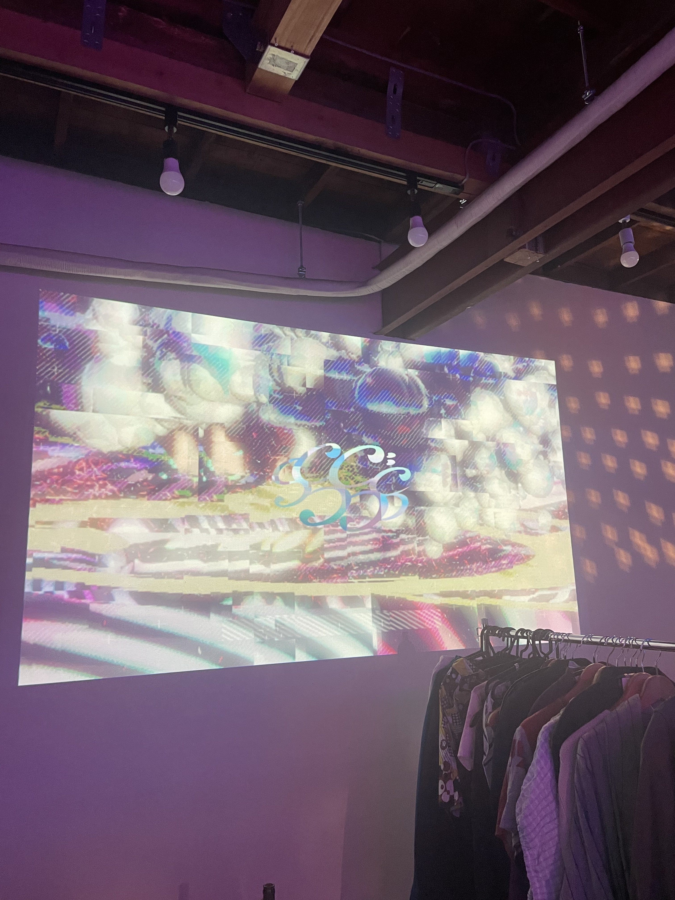
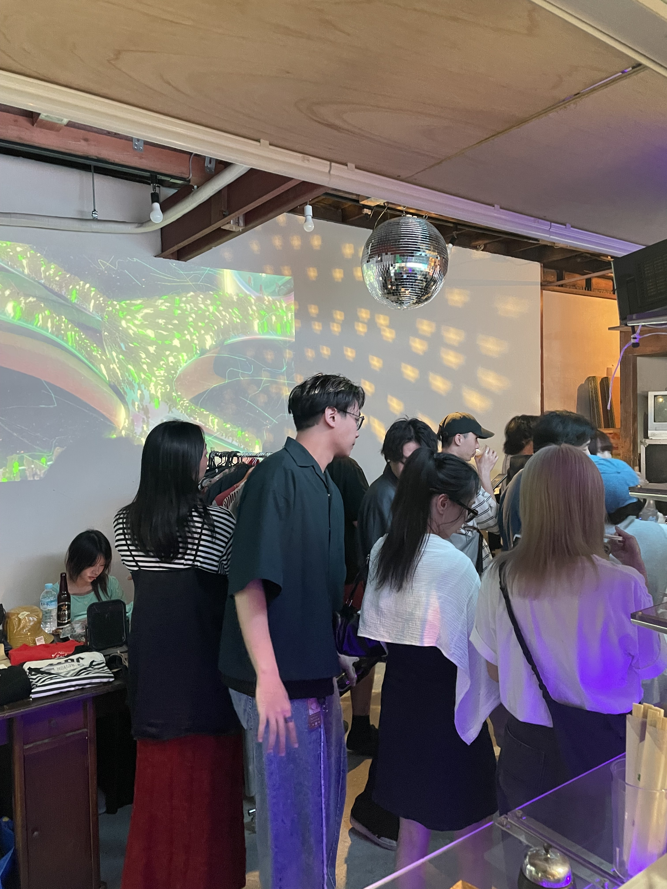

# Audio-Reactive VJ Production System for Live DJ Events

> **Roles:** Creative Technologist / Computer Graphics Engineer / Real-Time Interactive Systems Developer


## Executive Summary

### 日本語

高円寺 HoiPoi と台湾料理店 Shinju / Pearl のライブイベント向けに、DJ 音源へリアルタイムに反応する VJ ビジュアルシステムを制作しました。FFT によって低域・中域・高域のエネルギーを抽出し、C# の制御レイヤーから HLSL シェーダーへパラメータを送ることで、音楽の密度、アタック、展開に同期したジェネラティブ映像を生成しました。

### English

This project combines two live VJ productions built for DJ events at HoiPoi in Koenji and Shinju / Pearl, a Taiwanese restaurant venue. The system analyzes incoming DJ audio with FFT, extracts low-, mid-, and high-frequency behavior, and maps those signals into C#-driven HLSL shader parameters to generate real-time visuals synchronized with the music.

## Technical Core & Architectural Highlights

### Graphics Pipeline & Shading

- Built the visuals with a C# control layer and HLSL shaders.
- Sent FFT band values into shader parameters for real-time audio-reactive motion and color changes.
- Adjusted the visual tone for each venue instead of relying on a fixed pre-rendered video.

### Optimization Paradigms

- Kept the audio analysis lightweight enough for live playback.
- Clamped and normalized FFT values before sending them into the visual layer.
- Reused the same basic setup across both events, then tuned the look for each performance.

### Algorithms & Mathematics

- Used FFT analysis to read the live DJ audio as low-, mid-, and high-frequency bands.
- Mapped each frequency band to visual parameters such as scale, color, movement speed, and effect intensity.
- Added basic smoothing so the visuals reacted clearly without becoming too noisy.

## Production Scope

| Project | Venue | Date | Focus |
|---|---|---:|---|
| Pearl VJ Production | Shinju / Pearl Taiwanese restaurant event | Apr 2025 | Dense audio-reactive generative visuals for a restaurant-based DJ event |
| HoiPoi VJ Production | HoiPoi, Koenji Tokyo | May 2025 | Venue-tuned live visuals synchronized with DJ audio dynamics |

## Technical Pipeline Diagram

```text
                  CPU SIDE                                      GPU SIDE

 [DJ Mixer / Live Audio Input]
              |
              v
 [Audio Capture + Buffering]
              |
              v
 [FFT Spectrum Analysis]
              |
      +-------+--------+-------+
      |                |       |
      v                v       v
 [Low Band]       [Mid Band] [High Band]
      |                |       |
      +-------+--------+-------+
              |
              v
 [Normalization + Smoothing]
              |
              v
 [C# Visual Control Layer]
              |
              v
 [Shader Uniforms / Runtime Parameters] ---> [HLSL Procedural Visuals]
                                                     |
                                                     v
                                           [Render Pass Composition]
                                                     |
                                                     v
                                       [Projector / Screen / Venue Output]
```

## Demo Video

<iframe width="100%" height="420" src="https://www.youtube.com/embed/Xp4Q078MXng" title="Audio-Reactive VJ Production Demo" frameborder="0" allowfullscreen></iframe>

## Documentation & Gallery Grid

<table width="100%">
  <tr>
    <td width="50%"></td>
    <td width="50%"></td>
  </tr>
  <tr>
    <td width="50%"></td>
    <td width="50%"></td>
  </tr>
</table>

<table width="100%">
  <tr>
    <td width="50%"></td>
    <td width="50%"></td>
  </tr>
  <tr>
    <td width="50%"></td>
    <td width="50%"></td>
  </tr>
</table>

## Technical Stack

| Layer | Implementation |
|---|---|
| Audio analysis | FFT-based spectrum extraction |
| Runtime control | C# parameter mapping and event logic |
| Visual synthesis | HLSL shader-driven procedural visuals |
| Interaction model | Real-time response to DJ audio input |
| Output context | Live VJ projection / venue screen output |

## Outcome

The combined production demonstrates a reusable audio-reactive graphics pipeline for live performance contexts: one system architecture, two venue-specific executions, and a real-time visual language that translates frequency-domain audio behavior into responsive motion, color, density, and distortion.
